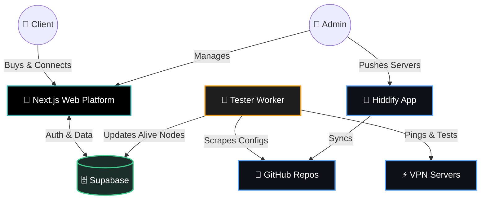

<div align="center">

  

  <br/>

  <a href="https://git.io/typing-svg">
    
  </a>

  <br/><br/>

  [](https://nextjs.org/)
  [](https://www.typescriptlang.org/)
  [](https://tailwindcss.com/)
  [](https://supabase.com/)
  
</div>


<div align="center">
  <p>
    <b>GalaxyVPN Pro</b> is not just a VPN app, it is a fully autonomous <b>ecosystem</b>. It automatically hunts for live servers, tests their latency across multiple network tiers, provisions access, handles billing, and provides enterprise-grade analytics.
  </p>
</div>


## ✨ Supernatural Features

<table style="width: 100%; border-collapse: collapse;">
<tr>
<td width="50%" valign="top">
  <h3>🚀 Warp-Speed VLESS</h3>
  <p>Built specifically to shatter the strictest DPI (Deep Packet Inspection) blocks. Next-generation VLESS & Reality protocols ensure invisible, high-speed routing.</p>
</td>
<td width="50%" valign="top">
  <h3>🤖 Autonomous Testing</h3>
  <p>A relentless background Node.js worker continuously fetches configs from GitHub, tests them in real-time (ping, reachability), and categorizes them by network type.</p>
</td>
</tr>
<tr>
<td width="50%" valign="top">
  <h3>💳 Smart Billing Engine</h3>
  <p>End-to-end subscription management. Users upload receipts, admins approve via the dashboard, and time-locks automatically grant or revoke server access.</p>
</td>
<td width="50%" valign="top">
  <h3>📊 Enterprise Analytics</h3>
  <p>A breathtaking admin dashboard tracking MRR (Monthly Recurring Revenue), ARPU (Average Revenue Per User), daily sales, and real-time server health distribution.</p>
</td>
</tr>
</table>

<br/>

<div align="center">
  
</div>

<br/>

## 🪐 Ecosystem Architecture

GalaxyVPN is built on a distributed, highly-scalable architecture:



<br/>

## 🛰️ Mission Control (Quick Start)

<details>
<summary><b>1️⃣ System Prerequisites</b> <i>(Click to expand)</i></summary>
<br/>

- Node.js 20+
- A Supabase Project
- Google Cloud Console Project (for OAuth)

</details>

<details>
<summary><b>2️⃣ Lift-Off (Installation)</b> <i>(Click to expand)</i></summary>
<br/>

Clone the repository and install the required dependencies:
```bash
git clone https://github.com/islemAZ360/Galaxy-VPN-pro.git
cd Galaxy-VPN-pro
npm install
```

</details>

<details>
<summary><b>3️⃣ Core Ignition (Environment)</b> <i>(Click to expand)</i></summary>
<br/>

Copy the example environment file and fill in your keys:
```bash
cp .env.example .env.local
```
*(See `SETUP.md` for detailed configuration).*

</details>

<details>
<summary><b>4️⃣ Database Sync</b> <i>(Click to expand)</i></summary>
<br/>

Run the SQL schema located in `supabase/schema.sql` in your Supabase SQL Editor. This sets up all necessary tables, RLS policies, and triggers.

</details>

<details>
<summary><b>5️⃣ Launch Server</b> <i>(Click to expand)</i></summary>
<br/>

Start the development server:
```bash
npm run dev
```
Visit `http://localhost:3000` to enter the Galaxy.

</details>

<br/>

## 🌠 Deployment

Deploying the GalaxyVPN ecosystem is streamlined via a Render Blueprint. 

1. Simply connect your GitHub repository to Render.
2. Use the included `render.yaml` file to spin up both the **Web Service** and the **Background Worker** simultaneously.
3. Configure your environment secrets in the dashboard.

---

<div align="center">
  
  <br/><br/>
  <i>Crafted with ❤️ and code to keep the internet open and free.</i>
</div>
